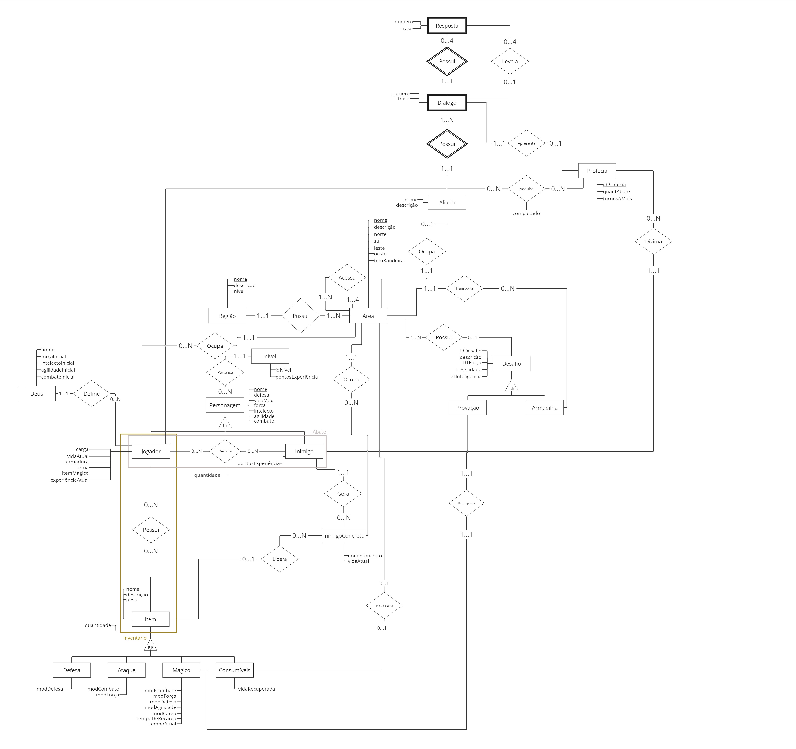
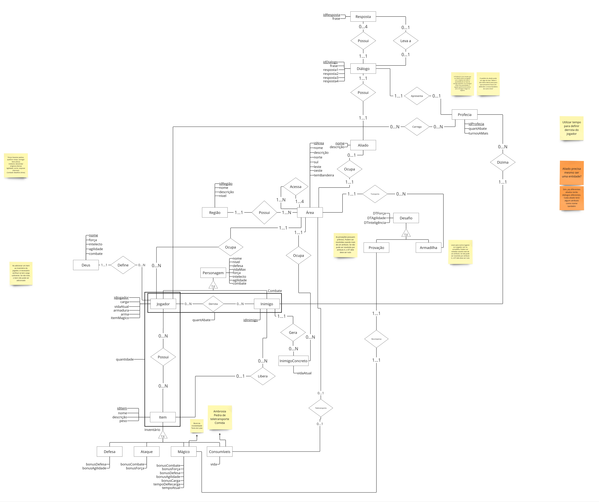

# DER

## Introdução

Um Diagrama Entidade Relacionamento  (DER) possui como objetivo demonstrar como "entidades" (pessoas, objetos, por exemplo) se relacionam entre si dentro de um contexto [1]. O DER será utilizado neste trabalho para fazer um mapeamento do banco de dados do jogo "Percy Jackson: Captura a Bandeira" a fim de identificar todos os dados que serão armazenados e a relação deles entre si.

## Versão Final

Versão Final (Versão 7) do Diagrama Entidade Relacionamento. Autores: Natan, Clara, Charles e Paulo. Ferramenta: Miro

## Versões DER

Versão 1

Versão 1 do Diagrama Entidade Relacionamento. Autores: Natan, Clara, Charles e Paulo. Ferramenta: Miro

Versão 2

Versão 2 do Diagrama Entidade Relacionamento. Autor: Natan. Ferramenta: Miro

Versão 3

Versão 3 do Diagrama Entidade Relacionamento. Autor: Natan. Ferramenta: Miro

Versão 4

Versão 4 do Diagrama Entidade Relacionamento. Autores: Natan, Clara, Charles e Paulo. Ferramenta: Miro

Versão 5

Versão 5 do Diagrama Entidade Relacionamento. Autor: Natan. Ferramenta: Miro

Versão 6

Versão 6 do Diagrama Entidade Relacionamento. AAutores: Natan, Clara, Charles e Paulo. Ferramenta: Miro

Versão 7

Versão 7 do Diagrama Entidade Relacionamento. Autores: Natan, Clara, Charles e Paulo. Ferramenta: Miro

## Referência Bibliográfica

> 1. O que é um diagrama entidade relacionamento? Disponível em: <https://www.lucidchart.com/pages/pt/o-que-e-diagrama-entidade-relacionamento>.

## Histórico de Versões

|  Versão  | Data | Descrição | Responsável |
| :---: | :---: | :---: | :---: | 
| 1.0 | 12/07 | Criação da página e adição da versão 1 e 2 do diagrama | [@Neitan2001](https://github.com/Neitan2001) |
| 2.0 | 15/07 | Adição da Versão 3 do diagrama | [@Neitan2001](https://github.com/Neitan2001) |
| 3.0 | 18/07 | Adição da Versão 4 do diagrama | [@Neitan2001](https://github.com/Neitan2001) |
| 4.0 | 18/07 | Adição da Versão 5 do diagrama | [@Neitan2001](https://github.com/Neitan2001) |
| 5.0 | 22/07 | Adição da Versão 6 do diagrama | [Paulo Henrique](https://github.com/owhenrique) |
| 6.0 | 22/07 | Adição da Versão 7 do diagrama | [Charles Serafim](https://github.com/charles-serafim) |
