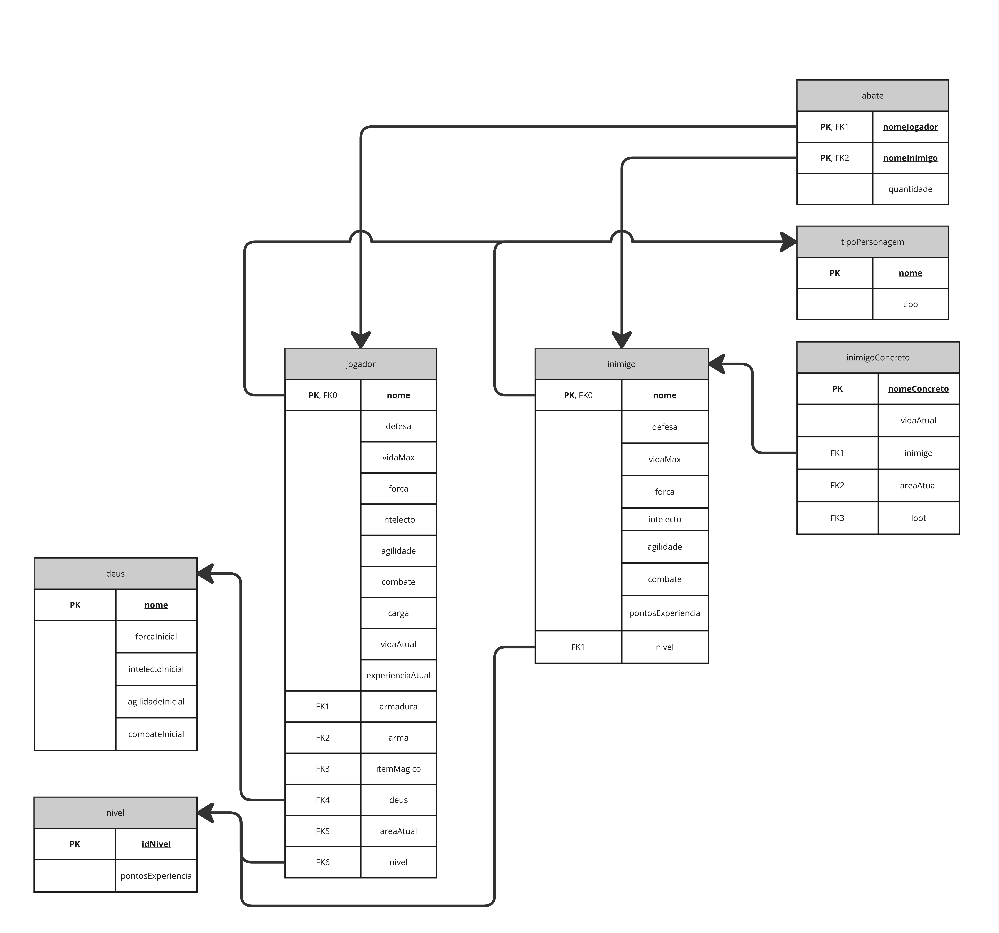
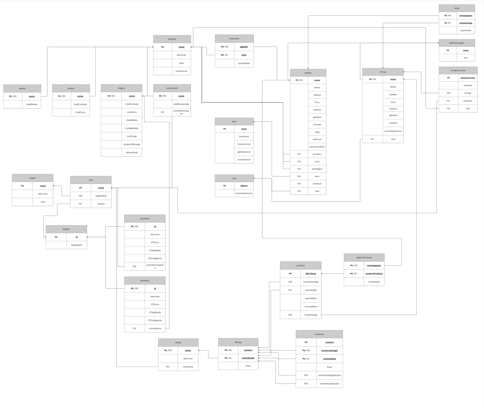

# Modelo Relacional

## Versão Final

Versão final (versão 8) do Modelo Relacional. Autores: Natan, Clara, Charles e Paulo. Ferramenta: Miro

## Versões do Modelo Relacional

Versão 1

Versão 1 do Modelo Relacional. Autores: Natan. Ferramenta: Miro

Versão 2

Versão 2 do Modelo Relacional. Autores: Natan. Ferramenta: Miro

Versão 3

Versão 3 do Modelo Relacional. Autores: Clara Marcelino. Ferramenta: Miro

Versão 4

Versão 4 do Modelo Relacional. Autores: Paulo. Ferramenta: Miro

Versão 5

Versão 5 do Modelo Relacional. Autores: Charles. Ferramenta: Miro

Versão 6

Versão 6 do Modelo Relacional. Autores: Charles, Paulo, Clara, Natan . Ferramenta: Miro

Versão 7

Versão 7 do Modelo Relacional. Autores: Charles, Paulo, Clara, Natan . Ferramenta: Miro

## Histórico de Versões

| Versão | Data  |                   Descrição                   |                      Responsável                      |
| :----: | :---: | :-------------------------------------------: | :---------------------------------------------------: |
|  1.0   | 18/07 |             Criação do documento              |     [@Neitan2001](https://github.com/Neitan2001)      |
|  2.0   | 18/07 |    Adição da versão 1 do Modelo Relacional    |     [@Neitan2001](https://github.com/Neitan2001)      |
|  3.0   | 19/07 |    Adição da versão 2 do Modelo Relacional    |     [@Neitan2001](https://github.com/Neitan2001)      |
|  4.0   | 21/07 |    Adição da versão 3 do Modelo Relacional    |   [Clara Ribeiro](https://github.com/clara-ribeiro)   |
|  5.0   | 22/07 |    Adição da versão 4 do Modelo Relacional    |    [Paulo Henrique](https://github.com/owhenrique)    |
|  6.0   | 22/07 |    Adição da versão 5 do Modelo Relacional    | [Charles Serafim](https://github.com/charles-serafim) |
|  7.0   | 19/08 | Adição das versões 6 e 7 do Modelo Relacional |    [Paulo Henrique](https://github.com/owhenrique)    |
|  8.0   | 09/08 | Adição da versão 8 do Modelo Relacional |    [Paulo Henrique](https://github.com/owhenrique)    |
